# Ejercicio 4 — CamMic ESCOM

**Cámara, micrófono y galería multiplataforma en Flutter**

## Participantes
* Chávez Romero Jonathan - 2024630102
* Moreno Noguerón Ximena - 2024630201
* Reyes Castellanos José Abel - 2020311353

> La siguiente carpeta contiene una app para **Android e iOS** desarrollada con Flutter, parte del ejercicio 4 de la Práctica 3 de la materia de Aplicaciones Móviles. Toma fotos con filtros, flash y temporizador, y graba audio con distintos niveles de sensibilidad y un temporizador de grabación. Todo el contenido se guarda con sus metadatos (fecha, ubicación y etiquetas) en SQLite, y se organiza en una galería con álbumes, un editor de imágenes y un reproductor de audio. La interfaz usa Material 3 con los temas **Guinda IPN** y **Azul ESCOM**, en modo claro u oscuro.

---

## Capturas de pantalla

> Las imágenes están en `docs/android/` y `docs/ios/`.

| Funcionalidad | Android | iOS |
|:---: | :---: |:---:|
| Captura de fotos | 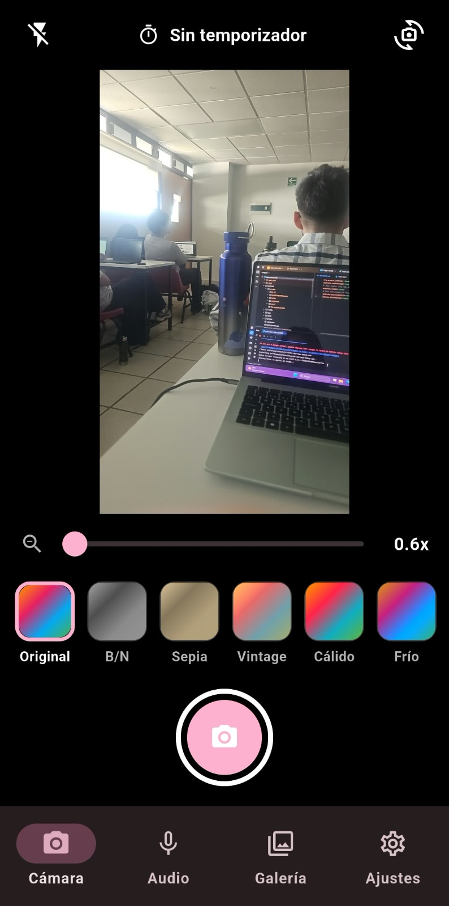 | 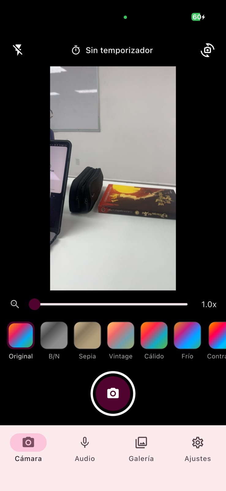 |
| Grabación de audio | 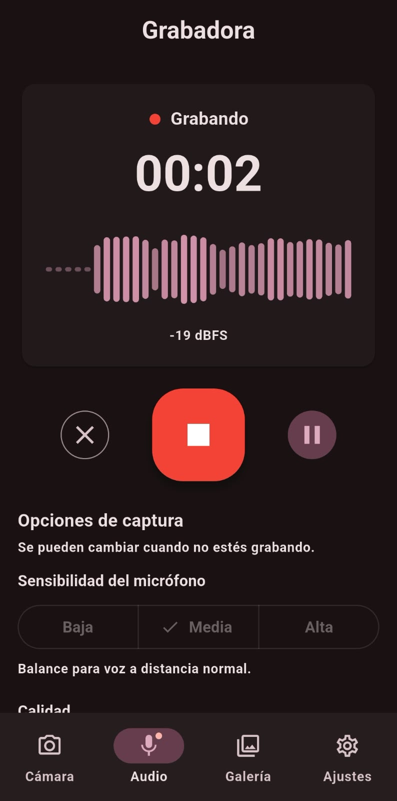 | 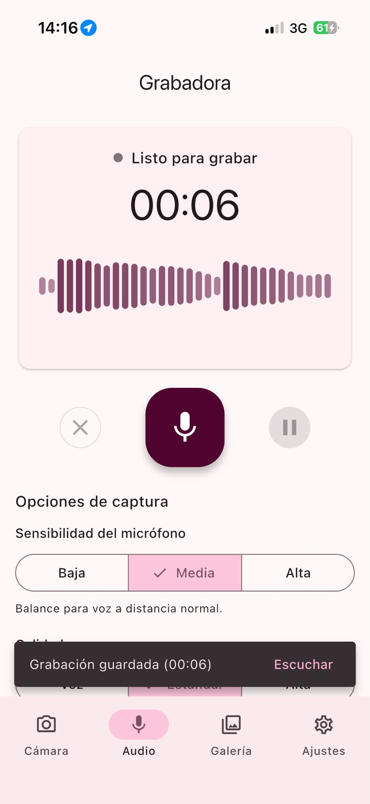 |
| Función de filtros | 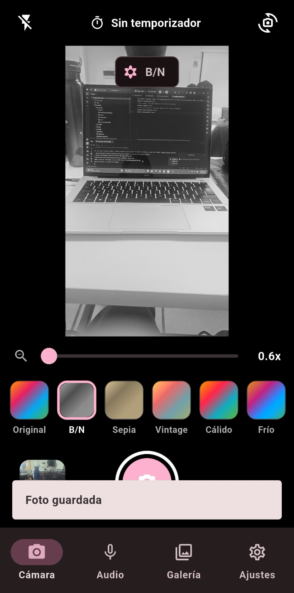 | 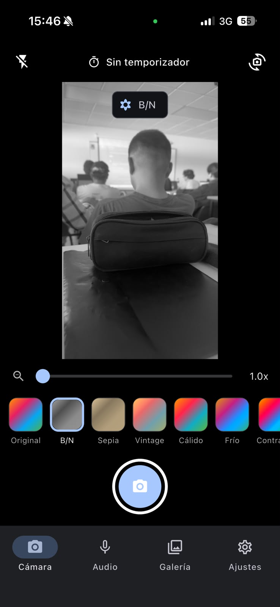 |
| Niveles de sensibilidad | 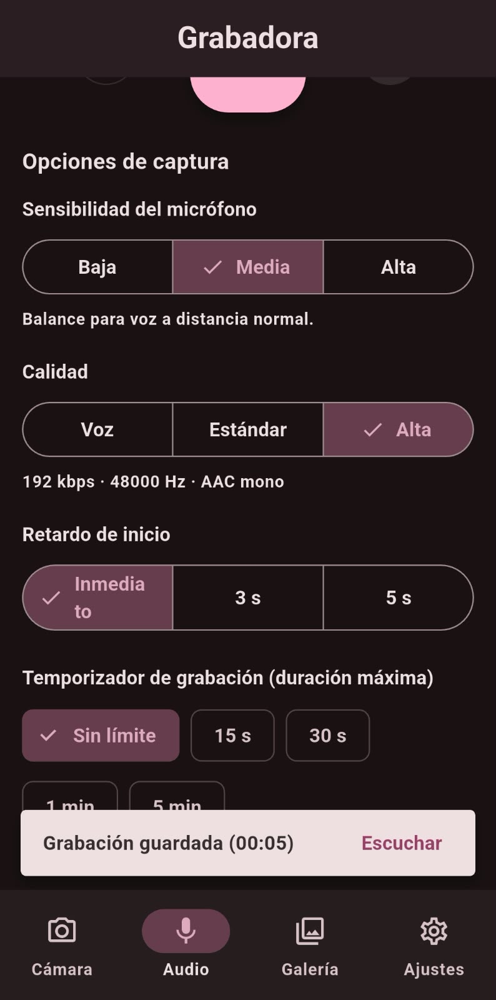 | 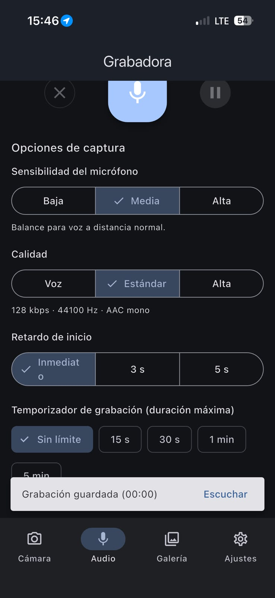 |
| Galería | 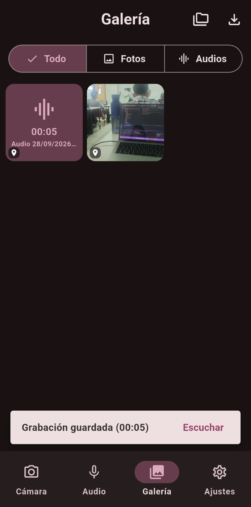 | 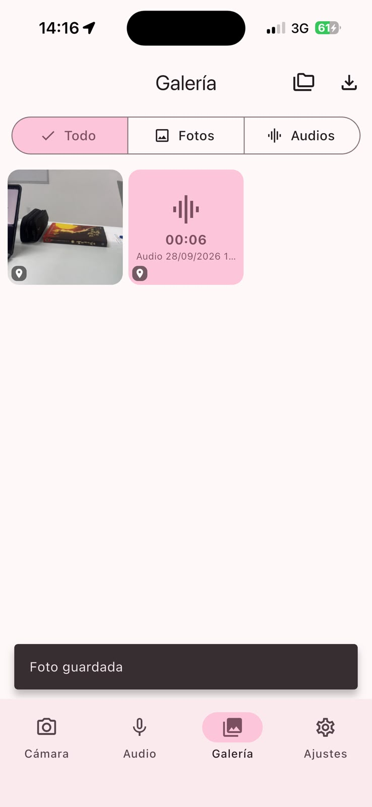 |
| Permisos de la aplicación | 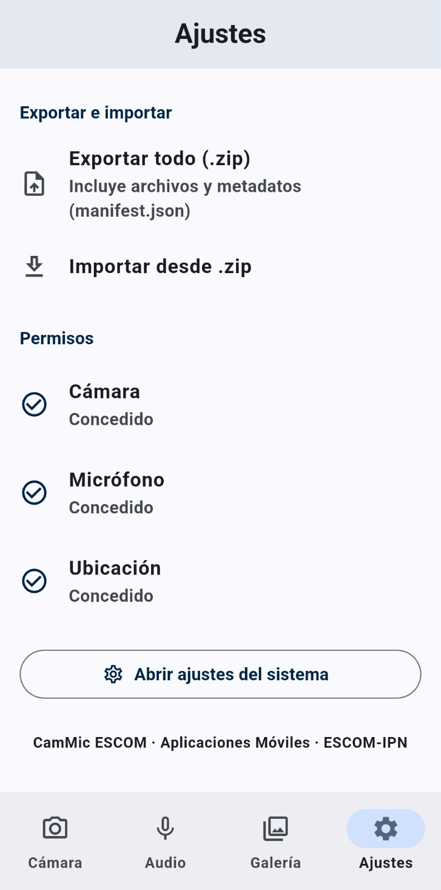 | 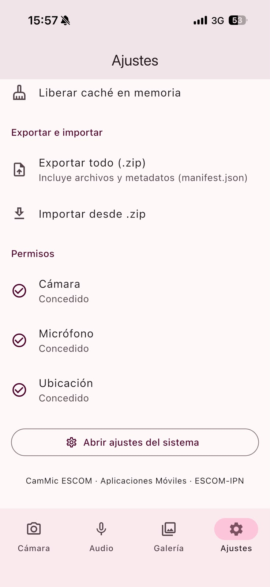 |
| Modo claro guinda | 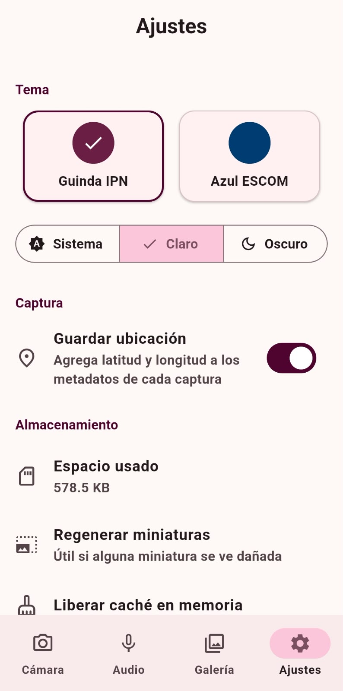 | 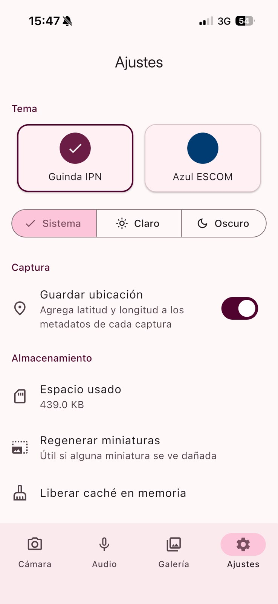 |
| Modo obscuro guinda | 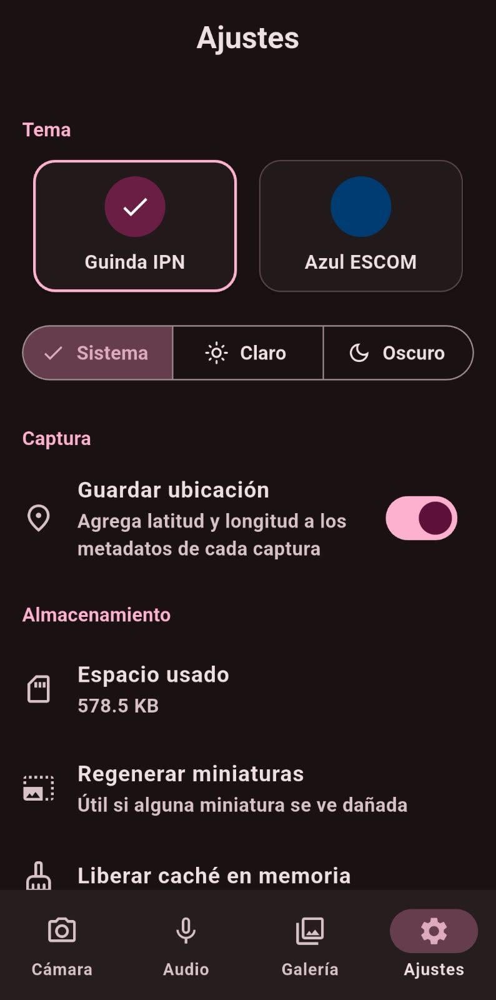 | 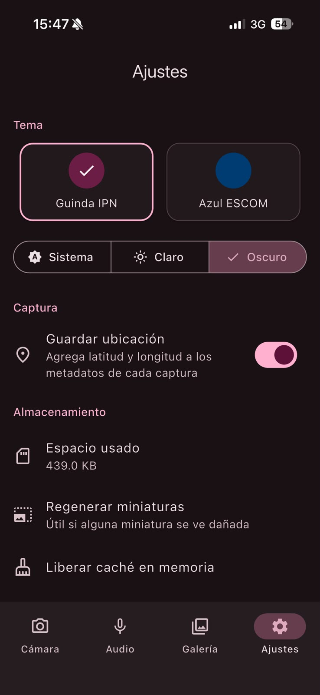 |
| Modo claro azul | 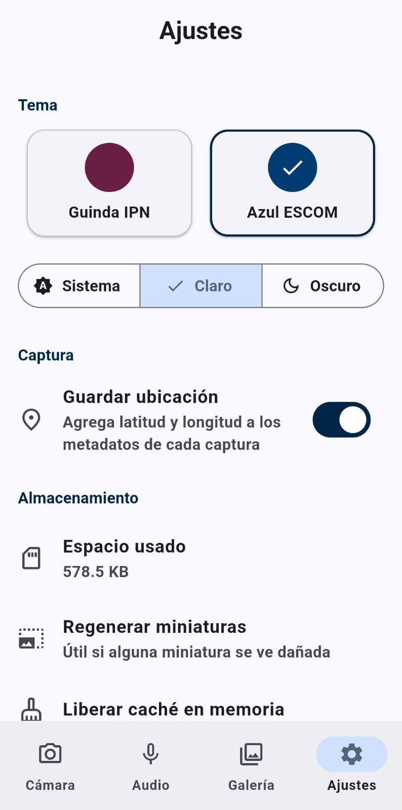 | 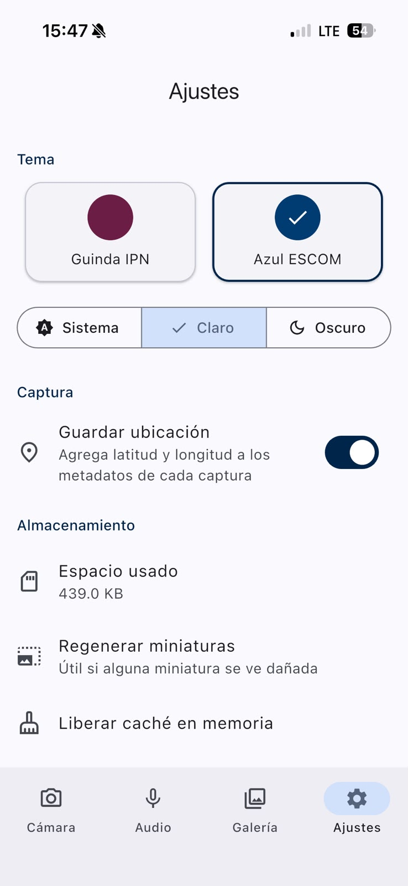 |
| Modo obscuro azul | 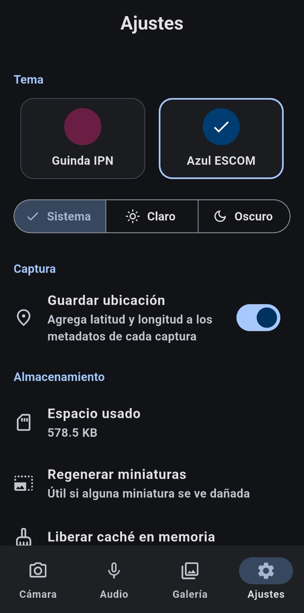 | 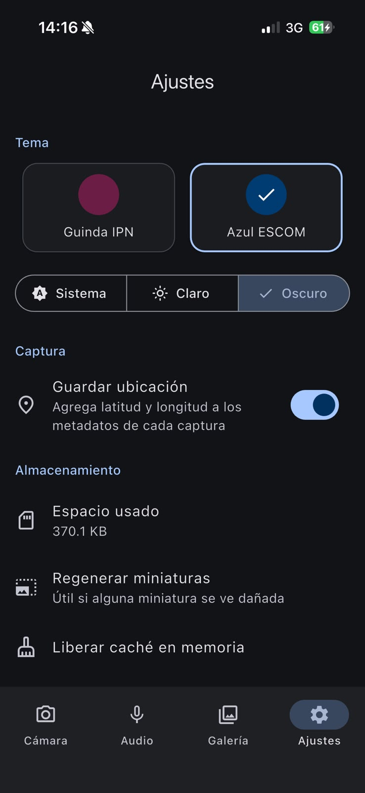 |

## Requisitos cumplidos

| Requisito | Implementación |
|---|---|
| Captura de fotos multiplataforma | Paquete `camera`: vista previa, cámara frontal/trasera y zoom. |
| Filtros | 9 filtros definidos como matrices de color 4×5. La misma matriz se usa en la vista previa (GPU, `ColorFiltered`) y al guardar (CPU, paquete `image` en un *Isolate*). |
| Flash y temporizador | Apagado, Auto, Encendido y Linterna; temporizador de 0, 3, 5 o 10 s con cuenta regresiva. |
| Grabación de audio con sensibilidad | Paquete `record` (AAC `.m4a`). La sensibilidad baja/media/alta ajusta el umbral en dB del medidor de nivel. |
| Temporizador de grabación | Duración máxima con detención automática y retardo de inicio. |
| Almacenamiento de archivos | Directorio de documentos de la app (`media/photos`, `media/audio`, `thumbnails`). En la base de datos se guardan rutas **relativas**, porque en iOS la ruta del contenedor cambia entre instalaciones. |
| `Info.plist` y permisos | Descripciones de uso de cámara, micrófono, ubicación y fotos. Solicitud en tiempo de ejecución con `permission_handler`; si se niega, se muestra una vista explicativa con acceso a Ajustes. |
| Galería integrada | Visor con edición básica, reproductor de audio y organización en álbumes y etiquetas. |
| Metadatos (equivalente a Core Data) | SQLite (`sqflite`): tablas `albums`, `media` y `tags` (relación N:M) con fecha, ubicación (`geolocator`), etiquetas, duración, tamaño y filtro, con índices por fecha, álbum y tipo. |
| Miniaturas y caché | Miniaturas JPEG en disco generadas en un *Isolate*, caché LRU en memoria (200 entradas) y `cacheWidth` al decodificar. |
| Exportar e importar | ZIP con los archivos y un `manifest.json`; se comparte con `share_plus` y se importa con `file_picker`, evitando duplicados. |
| Optimización de rendimiento | Procesamiento de imagen fuera del hilo de UI; la cámara se libera al cambiar de pestaña o pasar a segundo plano; consultas indexadas; cuadrícula perezosa. |
| Temas institucionales | Guinda IPN (`#6C1D45`) y Azul ESCOM (`#003B71`) con `ColorScheme.fromSeed`; modo claro/oscuro automático o manual, persistido. |
| Diseño consistente | Material 3 idéntico en Android e iOS. |
| Arquitectura y estado | Clean Architecture + Provider (`ChangeNotifier`). |
| Compilación en ambas plataformas | Probado en dispositivos físicos Android e iOS (ver abajo). |

---

### Dependencias principales

| Paquete | Uso |
|---|---|
| `provider` | Gestión de estado |
| `camera` | Captura de fotos |
| `record` | Grabación de audio |
| `just_audio` | Reproducción de audio |
| `permission_handler` | Permisos en tiempo de ejecución |
| `geolocator` | Ubicación en metadatos |
| `sqflite` | Base de datos de metadatos |
| `path_provider`, `path` | Rutas de almacenamiento |
| `shared_preferences` | Preferencias (tema, ubicación) |
| `image` | Filtros, edición y miniaturas |
| `archive` | Exportar/importar ZIP |
| `share_plus`, `file_picker` | Compartir e importar archivos |

---

## Entorno de pruebas

| | Android | iOS |
|---|---|---|
| **Dispositivo** | Samsung Galaxy A15 (SM-A155M) | iPhone 15 Pro |
| **Versión del SO** | Android 16 | 26.6.2 |
| **Equipo de compilación** | Windows + Android Studio | macOS + Xcode 27.0 |
| **Flutter** | 3.47.2 | 3.47.5 |
| **Gradle / CocoaPods** | Gradle 9.3.1 | CocoaPods 1.17.0 |


---

## Instalación y ejecución

```bash
git clone <URL_DEL_REPOSITORIO>
cd app_cam_micr
git checkout <NOMBRE_DE_LA_BRANCH>
flutter pub get
```

### Android

```bash
flutter run
```

> Nota: Se recomienda usar un dispositivo físico: la cámara del emulador es limitada.

### iOS (requiere macOS con Xcode)

```bash
cd ios && pod install && cd ..
```

1. Abre `ios/Runner.xcworkspace` en Xcode → target **Runner** → **Signing & Capabilities**.
2. Activa *Automatically manage signing* y selecciona tu equipo (sirve un Apple ID gratuito como *Personal Team*).
3. Conecta el iPhone, confía en la computadora y activa **Ajustes → Privacidad y seguridad → Modo de desarrollador**.
4. Ejecuta:

   ```bash
   flutter run --release
   ```

5. Si iOS bloquea la app, confía en el certificado en **Ajustes → General → VPN y gestión de dispositivos**.

> En modo *debug*, la app en iPhone solo abre mientras está conectada a la Mac; usa `--release` para abrirla desde el ícono. Con un Apple ID gratuito, la instalación caduca a los 7 días.

---

## Configuración de plataforma

### Permisos declarados

| Permiso | Android (`AndroidManifest.xml`) | iOS (`Info.plist`) |
|---|---|---|
| Cámara | `CAMERA` | `NSCameraUsageDescription` |
| Micrófono | `RECORD_AUDIO` | `NSMicrophoneUsageDescription` |
| Ubicación | `ACCESS_FINE_LOCATION`, `ACCESS_COARSE_LOCATION` | `NSLocationWhenInUseUsageDescription` |
| Fotos | — | `NSPhotoLibraryUsageDescription` |
| Archivos de la app visibles | — | `UIFileSharingEnabled`, `LSSupportsOpeningDocumentsInPlace` |

En Android, la cámara se declara con `android:required="false"` para que la app pueda instalarse en dispositivos sin cámara (galería y audio siguen funcionando).

### Ajustes específicos

**iOS: `ios/Podfile`.** Versión mínima iOS 13.0 y macros de `permission_handler`:

```ruby
config.build_settings['GCC_PREPROCESSOR_DEFINITIONS'] ||= [
  '$(inherited)',
  'PERMISSION_CAMERA=1',
  'PERMISSION_MICROPHONE=1',
  'PERMISSION_LOCATION=1',
  'PERMISSION_LOCATION_WHENINUSE=1',
]
```

Sin estas macros, `permission_handler` devuelve siempre "denegado" en iOS sin mostrar el diálogo.

**Android: `android/build.gradle.kts`.** Corrección para `camera_android_camerax` 0.6.x con Gradle 9 (ver *Problemas encontrados*):

```kotlin
subprojects {
    if (name == "camera_android_camerax") {
        plugins.withId("com.android.library") {
            dependencies.add("implementation", "androidx.concurrent:concurrent-futures:1.2.0")
        }
    }
}
```

**Android: `android/gradle.properties`.**

```properties
kotlin.incremental=false
```

---

## Notas

- Para compilar iOS se necesita macOS con Xcode; no es posible desde Windows.
- Algunos paquetes tienen versiones mayores disponibles (`flutter pub outdated`). Se mantuvieron las versiones actuales para no romper APIs.