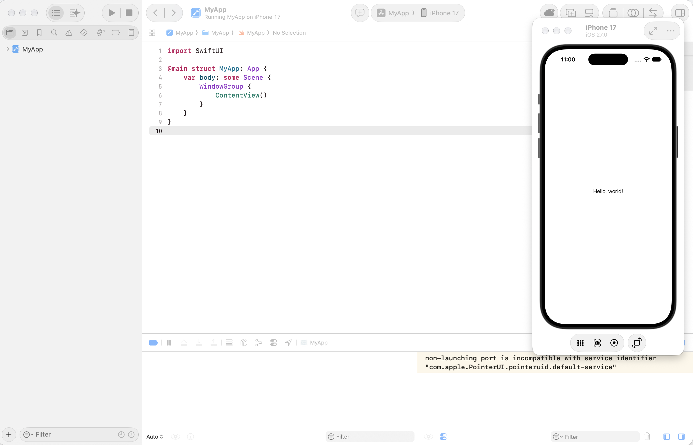

# Ejercicio 1 — Instalación de iOS/macOS en la Mejor PC del Equipo

## Participantes
* Chávez Romero Jonathan - 2024630102
* Moreno Noguerón Ximena - 2024630201
* Reyes Castellanos José Abel - 2020311353

> La siguiente carpeta contiene la documentación y evidencias correspondientes al **Ejercicio 1** de la Práctica 3 de la materia de Aplicaciones Móviles, enfocado en la selección del equipo con las mejores especificaciones del equipo, la instalación de un entorno de desarrollo macOS/iOS con Xcode, y la verificación de que dicho entorno quedó funcional mediante la ejecución de un proyecto de prueba en el Simulador de iPhone.

---

## Comparativa de especificaciones de las PCs del equipo

| Integrante | Procesador (CPU) | Memoria RAM | Almacenamiento | Tarjeta Gráfica (GPU) | Sistema Operativo |
|:---|:---|:---|:---|:---|:---|
| Chávez Romero Jonathan | Ryzen 7 5800H | 16 GB | 512 GB SSD | NVIDIA RTX 3060 | Windows 11 |
| Moreno Noguerón Ximena | Intel Core 5 | 16 GB | 1 TB SSD | Intel ARC Graphics | Windows 11 |
| Reyes Castellanos José Abel | Apple M4 | 16 GB | 512 GB SSD | Apple M4 GPU | macOS |

### Selección de la mejor PC

| | |
|---|---|
| **PC seleccionada (dueño del equipo)** | Reyes Castellanos José Abel |
| **Número de boleta** | 2020311353 |
| **Justificación** | La selección se basó en la necesidad de contar con un entorno nativo para el desarrollo de aplicaciones iOS/macOS, lo cual requiere un sistema operativo macOS. La PC de José Abel cumple con los requisitos necesarios para instalar y ejecutar Xcode, además de ofrecer un rendimiento óptimo gracias a su procesador Apple M4 y su GPU integrada. |

---

## Bitácora de sesiones de trabajo

| Sesión | Fecha | Hora | Modalidad | Integrantes presentes | Actividades realizadas |
|---|---|---|---|---|---|
| 1. Análisis de equipos y selección | 14/09/2026 | 9:00 PM - 10:00 PM | Virtual | Todos los integrantes del equipo | Discusión sobre las especificaciones de cada PC, análisis de compatibilidad con el entorno de desarrollo iOS/macOS, y selección del equipo más adecuado. |
| 2. Configuración del entorno e instalación | 15/09/2026 | 9:30 PM - 11:30 PM | Virtual | Todos los integrantes del equipo | Configuración del entorno de desarrollo y instalación de Xcode. |

---

## Capturas de pantalla

> La imagen está en la carpeta `docs/` junto a este README.

| Funcionalidad | Evidencia |
|:---:|:---:|
| Instalación de Xcode y ejecución de un proyecto de prueba en el Simulador de iPhone 17 (iOS 27.0) |  |

El mensaje `non-launching port is incompatible with service identifier "com.apple.PointerUI.pointeruid.default-service"` que aparece en la consola es un aviso normal y sin impacto del propio Simulador de iOS (relacionado con el puntero del mouse en el simulador), no un error de la aplicación ni de la instalación.

---

## Entorno de instalación

| | |
|---|---|
| **Equipo** | MacBook Pro, Apple M4 |
| **Sistema operativo** | macOS |
| **IDE** | Xcode |
| **Destino de prueba** | Simulador de iPhone 17, iOS 27.0 |

---

## Instalación y ejecución

Pasos para reproducir la verificación del entorno:

1. Abrir **Xcode** y seleccionar **File → New → Project...**
2. Elegir la plantilla **App**, en la pestaña **iOS**.
3. Configurar el proyecto:
   - **Product Name:** `MyApp`
   - **Interface:** SwiftUI
   - **Language:** Swift
4. Guardar el proyecto en una ubicación local.
5. En la barra superior de Xcode, seleccionar como destino un simulador de **iPhone** (por ejemplo, iPhone 17).
6. Ejecutar el proyecto:

   ```bash
   # o bien, desde Xcode con el botón ▶️ Run
   ⌘R
   ```

7. Verificar que el Simulador de iOS abra y muestre la app corriendo con el texto **"Hello, world!"**, confirmando que Xcode, el SDK de iOS y el Simulador quedaron correctamente instalados y funcionales.

---

## Notas

- Para compilar proyectos iOS se necesita una Mac con macOS y Xcode instalado; no es posible desde Windows sin herramientas de virtualización o servicios en la nube.
- Esta instalación es el punto de partida para los Ejercicios 2 y 3 de la práctica, desarrollados de forma nativa en Swift/SwiftUI sobre este mismo entorno.
