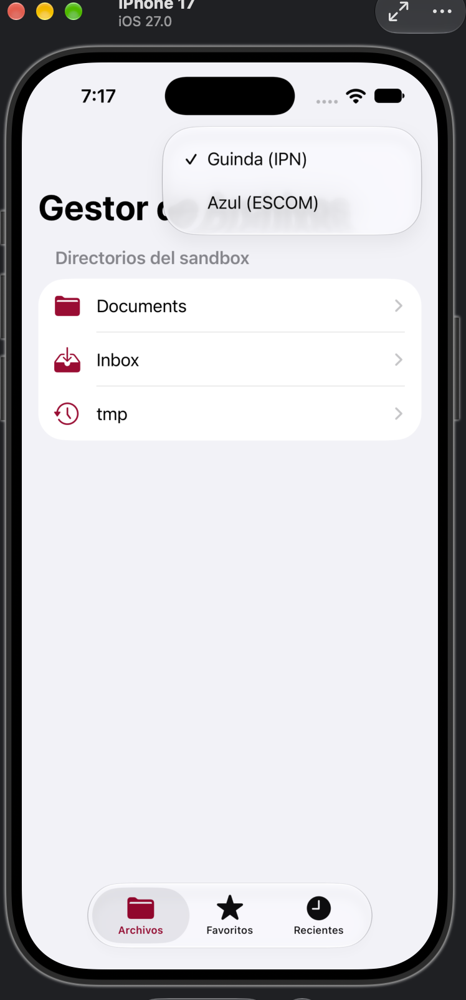
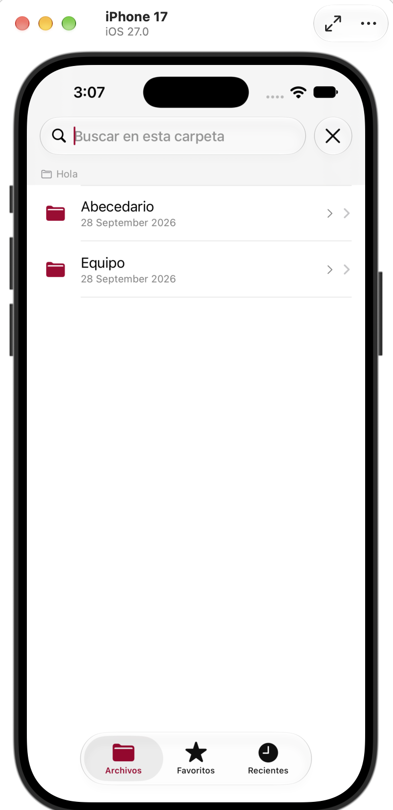
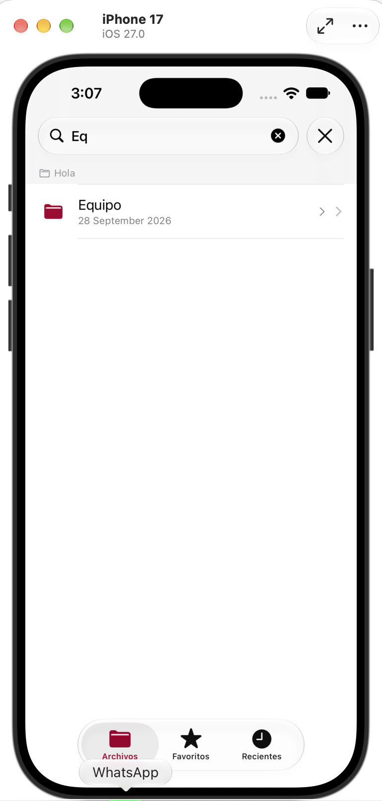

# Ejercicio 2 — Gestor de Archivos para iOS

## Participantes
* Chávez Romero Jonathan - 2024630102
* Moreno Noguerón Ximena - 2024630201
* Reyes Castellanos José Abel - 2020311353

> La siguiente carpeta contiene una app **nativa de iOS** desarrollada con SwiftUI, parte del Ejercicio 2 de la Práctica 3 de la materia de Aplicaciones Móviles. Permite explorar el sistema de archivos del sandbox de la app: navegar entre carpetas y subcarpetas, ver el contenido de cada una, buscar dentro de la carpeta actual, y mostrar en todo momento, mediante una barra de ruta (breadcrumb), la ubicación actual dentro del árbol de directorios. La interfaz incluye además un selector de tema con los colores institucionales **Guinda (IPN)** y **Azul (ESCOM)**.

---

## Capturas de pantalla

> Las imágenes están en la misma carpeta que este README, dentro de `docs/`.

| Funcionalidad | Evidencia |
|:---:|:---:|
| Pantalla principal, directorios raíz del sandbox y selector de tema (Guinda/Azul) |  |
| Navegación dentro de una carpeta, con la barra de ruta (breadcrumb) mostrando la ubicación actual |  |
| Búsqueda de archivos/carpetas dentro de la carpeta actual |  |

---

## Requisitos cumplidos

| Requisito | Implementación |
|---|---|
| Listado del sistema de archivos | Lectura del sandbox de la app con `FileManager`, mostrando carpetas y archivos en una `List`. |
| Navegación entre carpetas | `NavigationStack` con `NavigationLink(value:)` y `.navigationDestination(for:)`, permitiendo entrar y salir de subcarpetas de forma consistente en toda la jerarquía. |
| Ruta / carpeta actual visible en todo momento | Barra de breadcrumb fija en la parte superior de cada pantalla, que concatena el nombre de cada nivel recorrido (`pathComponents`) separado por `›`. |
| Búsqueda dentro de una carpeta | Barra de búsqueda que filtra en vivo los elementos (carpetas/archivos) de la carpeta actual. |
| Temas institucionales | Guinda (IPN) y Azul (ESCOM), seleccionables desde un menú en la pantalla principal. |
| Interfaz nativa iOS | SwiftUI, siguiendo los lineamientos de diseño de Apple (Human Interface Guidelines). |

---

## Entorno de pruebas

| | |
|---|---|
| **Equipo de compilación** | MacBook Pro, Apple M4, macOS |
| **IDE** | Xcode |
| **Destino de prueba** | Simulador de iPhone, iOS |

---

## Instalación y ejecución

```bash
git clone <URL_DEL_REPOSITORIO>
cd App-Android-iOS/ejercicio_2_gestor_archivos
```

1. Abre `GestorArchivos.xcodeproj` (o el `.xcodeproj` correspondiente) en Xcode.
2. Selecciona como destino un simulador de **iPhone**.
3. Ejecuta el proyecto con el botón **▶️ Run** (o `⌘R`).
4. Navega por las carpetas de ejemplo del sandbox de la app y verifica que la barra de ruta en la parte superior se actualice conforme entras y sales de subcarpetas.

---

## Notas

- La navegación usa exclusivamente el patrón `NavigationLink(value:)` + `.navigationDestination(for:)` en todos los niveles, evitando mezclarlo con `NavigationLink(destination:)`, ya que combinarlos provoca que las navegaciones más profundas dejen de funcionar.
