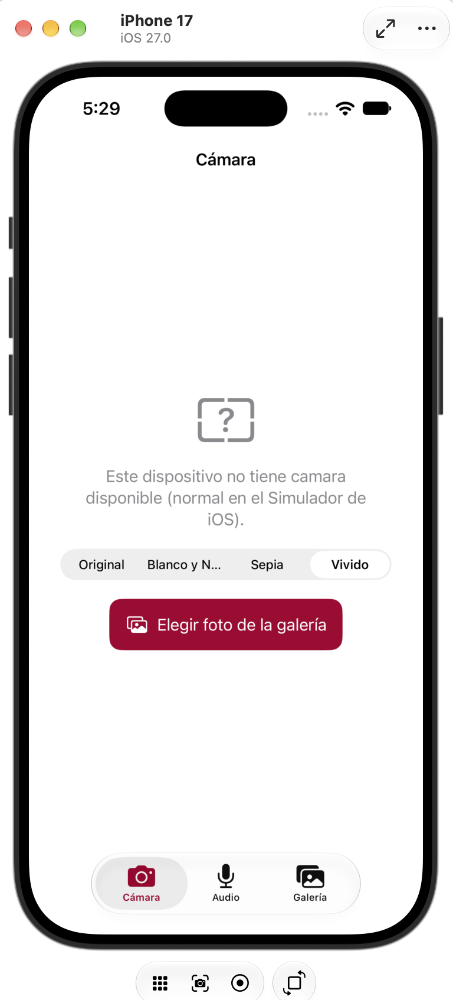
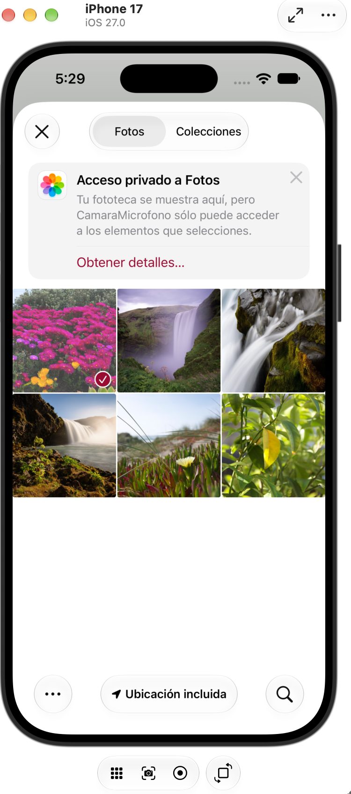
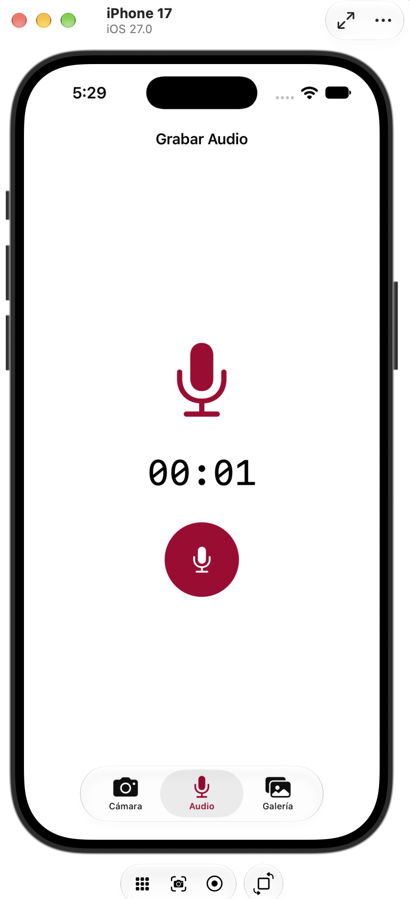
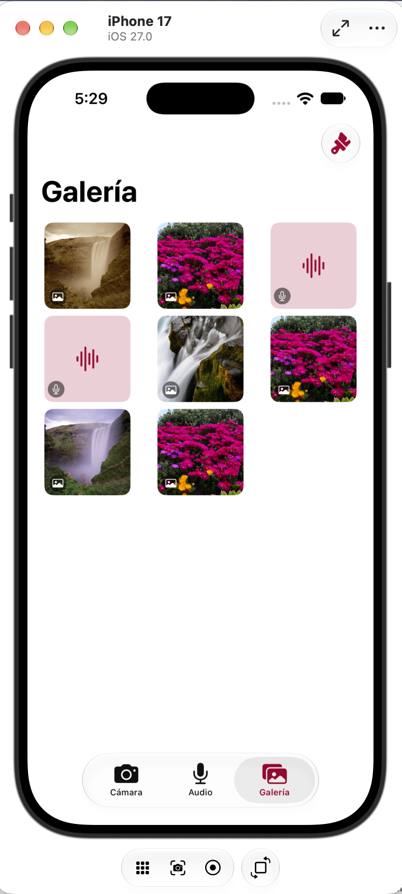

# Ejercicio 3 — Cámara y Micrófono para iOS

## Participantes
* Chávez Romero Jonathan - 2024630102
* Moreno Noguerón Ximena - 2024630201
* Reyes Castellanos José Abel - 2020311353

> La siguiente carpeta contiene una app **nativa de iOS** desarrollada con SwiftUI, parte del Ejercicio 3 de la Práctica 3 de la materia de Aplicaciones Móviles. Permite capturar fotos con filtros, flash y temporizador usando AVFoundation, con un selector de fotos (PHPicker) como alternativa cuando no hay cámara física disponible (por ejemplo, en el Simulador de iOS). También permite grabar y reproducir audio con AVAudioRecorder/AVAudioPlayer. Todo el contenido capturado se guarda con sus metadatos en Core Data y se organiza en una galería, con temas institucionales **Guinda (IPN)** y **Azul (ESCOM)**.

---

## Capturas de pantalla

> Las imágenes están en la misma carpeta que este README, dentro de `docs/`.

| Funcionalidad | Evidencia |
|:---:|:---:|
| Cámara con filtros (Original, Blanco y Negro, Sepia, Vívido); alternativa con selector de fotos cuando no hay cámara física |  |
| Selector de fotos (PHPicker) como respaldo de la cámara |  |
| Grabación de audio con cronómetro en vivo |  |
| Galería con fotos y audios capturados, guardados con Core Data |  |

---

## Requisitos cumplidos

| Requisito | Implementación |
|---|---|
| Captura de fotos | `AVFoundation`: `AVCaptureSession`, `AVCapturePhotoOutput` y visor en vivo mediante `AVCaptureVideoPreviewLayer` (vía `UIViewRepresentable`). |
| Filtros | 4 filtros con Core Image (`CoreImage.CIFilterBuiltins`): Original, Blanco y Negro, Sepia y Vívido. |
| Flash y temporizador | Flash encendido/apagado y temporizador con cuenta regresiva (0, 3 o 10 s) antes de capturar. |
| Alternativa sin cámara física | Cuando `AVCaptureDevice.default(for: .video)` es `nil` (como en el Simulador de iOS), se muestra un `PhotosPicker` (PHPicker) para elegir una foto de la librería en su lugar, aplicándole el mismo filtro seleccionado. |
| Grabación de audio | `AVAudioRecorder` con formato AAC (`.m4a`), permisos de micrófono y cronómetro en vivo. |
| Reproducción de audio | `AVAudioPlayer` integrado en la vista de detalle de cada grabación. |
| Metadatos y persistencia | Core Data con un modelo (`NSManagedObjectModel`) construido programáticamente; entidad `MediaItem` con tipo, nombre de archivo, fecha, duración y filtro usado. |
| Galería integrada | Cuadrícula con miniaturas de fotos y audios, ordenados del más reciente al más antiguo, con vista de detalle para cada uno. |
| Permisos | `NSCameraUsageDescription` y `NSMicrophoneUsageDescription` declarados en `Info.plist`, con solicitud en tiempo de ejecución. |
| Temas institucionales | Guinda (IPN) y Azul (ESCOM), seleccionables desde la galería, con soporte de modo claro/oscuro. |

---

## Entorno de pruebas

| | |
|---|---|
| **Equipo de compilación** | MacBook Pro, Apple M4, macOS |
| **IDE** | Xcode |
| **Destino de prueba** | Simulador de iPhone 17, iOS 27.0 |

> Nota: el Simulador de iOS no tiene cámara física — es normal y esperado. La app lo detecta y muestra el selector de fotos (PHPicker) en su lugar. El micrófono del Simulador sí funciona (usa el micrófono de la Mac), por lo que la grabación de audio se probó de forma normal.

---

## Instalación y ejecución

```bash
git clone <URL_DEL_REPOSITORIO>
cd App-Android-iOS/ejercicio_3_camara_microfono
```

1. Abre `CamaraMicrofono.xcodeproj` en Xcode.
2. Verifica en el target → pestaña **Info** que estén declaradas las claves **Privacy - Camera Usage Description** y **Privacy - Microphone Usage Description** con un texto no vacío.
3. Selecciona como destino un simulador de **iPhone** (o un iPhone físico conectado).
4. Ejecuta el proyecto con el botón **▶️ Run** (o `⌘R`).
5. En la pestaña **Cámara**, toma una foto (o elige una de la galería si no hay cámara física) y prueba los distintos filtros.
6. En la pestaña **Audio**, graba y reproduce un audio.
7. En la pestaña **Galería**, verifica que ambos elementos aparezcan, y prueba el cambio de tema (Guinda/Azul).

---

## Notas

- Se probó tanto en Simulador de iPhone como intentando conexión con un iPhone físico; el flujo alternativo con PHPicker garantiza que la app sea completamente funcional en cualquiera de los dos casos.
- Los archivos reales (fotos/audio) se guardan en el sandbox de la app (`Documents/Capturas`); en Core Data solo se guardan sus metadatos y nombre de archivo.
